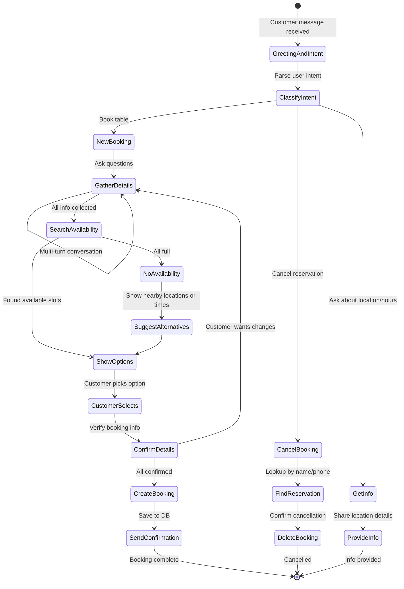

# 🍝 GoodFoods AI Reservation Assistant

> **A conversational AI booking platform built for GoodFoods' 50-restaurant chain across India, designed to scale to any time-bound resource allocation vertical (hotels, spas, salons, event venues).**

[](https://www.python.org/downloads/)
[](https://streamlit.io)

---

## 📋 Table of Contents

- [Overview](#overview)
- [Video Demo](#video-demo)
- [Business Context](#business-context)
- [Quick Start](#quick-start)
- [Architecture](#architecture)
- [Prompt Engineering Strategy](#prompt-engineering-strategy)
- [Example Conversations](#example-conversations)
- [File Structure](#file-structure)
- [Business Strategy](#business-strategy)
- [Assumptions & Limitations](#assumptions--limitations)
- [Future Enhancements](#future-enhancements)
- [Solution Design & Business Strategy Doc](#goodfoods-context)

---

## 🎯 Overview

GoodFoods AI Assistant is a **conversational booking platform** that replaces fragmented phone-based reservations with a unified AI-first channel. Built as an MVP for GoodFoods (a cult-favorite Italian restaurant chain with 50 locations across India), it demonstrates a domain-agnostic framework that can scale to any business requiring availability-based reservations.

## Video Demo

[Click here for Video demo - Gdrive](https://drive.google.com/file/d/1ecpoT_e6oQc-ajodKXMMEaX6q6AxpE_X/view?usp=sharing)

[Alternative Dropbox link](https://drive.google.com/file/d/1ecpoT_e6oQc-ajodKXMMEaX6q6AxpE_X/view?usp=sharing)

### Key Features

✅ **Built from Scratch** - No LangChain, LangGraph or any high-level framework dependencies. pure LLM orchestration with custom state management

✅ **Natural Language Understanding** - "Table for 4 tomorrow at 8pm in Bandra" → Instant availability check

✅ **Multi-Location Intelligence** - If preferred location is full, suggests nearby alternatives

✅ **One-Conversation Booking** - Complete booking flow in a single interaction

✅ **Real-Time Availability** - Checks across all 50 locations instantly

✅ **Cancellation Management** - Easy reservation lookups and cancellations

✅ **24/7 Availability** - No hold music, no missed calls


### Success Metrics (12-Month Target)

| Metric | Current | Target | Impact |
|--------|---------|--------|--------|
| **AI Adoption Rate** | 0% | 50% | Validates customer willingness to use AI |
| **Conversion Rate** | 60-65% | 75% | Proves AI booking > phone experience |
| **CSAT** | 3.8-4.0 | 4.0+ | Customer satisfaction indicator |
| **No-Show Rate** | 20-27% | 13-15% | Reduces revenue loss, improves utilization |

---

## 🏢 Business Context

### The Problem

GoodFoods operates **50 restaurants across India** with fragmented phone-based reservations:

- ❌ **50 separate phone lines** - Customers navigate multiple numbers
- ❌ **Peak hour chaos** - Missed calls = lost bookings (23% unanswered during rush)
- ❌ **No cross-location awareness** - Customer doesn't know about alternatives
- ❌ **20-27% no-show rate** - Lack of post-booking engagement
- ❌ **No customer data** - Can't personalize or predict preferences

### The Solution

A **single AI agent** accessible via WhatsApp/web/phone that:

- ✅ Handles all booking workflows (create, modify, cancel, lookup)
- ✅ Checks real-time availability across all 50 locations
- ✅ Suggests alternatives if preferred location is full
- ✅ Captures customer data for future personalization
- ✅ Reduces staff phone handling time by 80%

Solution is meant to own the post discovery phase and iteractions with customers - building loyalty and data.

### Business Impact (Year 1 Projection)

- 📈 **18-25% revenue increase** (higher booking volume + 27% no-show reduction)
- ⏱️ **80% reduction** in staff phone handling time
- 📊 **Customer data capture** for targeted loyalty programs
- 🚀 **Foundation for white-label expansion** to other restaurant chains

---

## ⚡ Quick Start

### Prerequisites

- Python 3.9+
- Together AI API key ([get one here](https://api.together.xyz))

### Installation

```bash
# 1. Clone repository
git clone https://github.com/Rohityalavarthy/goodfoods_booking_system.git
cd goodfoods-ai-assistant

# 2. Create virtual environment
python -m venv venv
source venv/bin/activate  # Windows: venv\Scripts\activate

# 3. Install dependencies
pip install -r requirements.txt

# 4. Configure API key
create a .env and add your TOGETHER_API_KEY=your_key_here - in that format
```

### Run the Application

```bash
streamlit run app.py
```

The app will open at `http://localhost:8501`

### Try It Out

**Example conversation:**
```
You: Hi! I'd like to book a table for 4 people tomorrow at 8pm in Bandra

Bot: Great! I found 2 great option(s):

1. GoodFoods Bandra East 📍
   • Location: 200 Bandra East, Mumbai 400002
   • Available: 19:30, 19:45, 20:00
   • Capacity: 40 seats
   • Features: Outdoor seating, Valet parking

2. GoodFoods Bandra West 📍
   • Location: 100 Bandra West, Mumbai 400001
   • Available: 19:30, 19:45, 20:00
   • Capacity: 35 seats
   • Features: Private dining, Valet parking

Which one would you like? Please also provide your name and phone number!

You: First one, Priya, 9876543210

Bot: ✅ Booking Confirmed!

🎫 Confirmation: GF-MUM-251125-A3F2
📍 Restaurant: GoodFoods Bandra East
📅 Date: 2025-11-25
🕐 Time: 20:00
👥 Party: 4 people

See you soon! 🎉
```

---

## 🏗️ Architecture

### System Design

```
┌─────────────────┐
│   User Input    │
│  (Streamlit UI) │
└────────┬────────┘
         │
         ▼
┌─────────────────────────────────────────────┐
│      Conversation Manager                   │
│  - State tracking                          │
│  - Context management                      │
│  - Multi-turn conversation handling        │
└────────┬────────────────────────────────────┘
         │
         ▼
┌─────────────────────────────────────────────┐
│         LLM Client (Together AI)            │
│  - Natural language understanding          │
│  - Intent classification                   │
│  - Entity extraction (date, time, location)│
│  - Tool calling orchestration              │
└────────┬────────────────────────────────────┘
         │
         ▼
┌─────────────────────────────────────────────┐
│           Tool Functions                    │
│  1. search_restaurants                     │
│  2. select_restaurant_and_book             │
│  3. find_reservation                       │
│  4. cancel_reservation                     │
└────────┬────────────────────────────────────┘
         │
         ▼
┌─────────────────────────────────────────────┐
│          Data Layer (JSON)                  │
│  - restaurants.json (50 locations)         │
│  - reservations.json (bookings)            │
│  - booking_constraints.json (rules)        │
└─────────────────────────────────────────────┘
```

### State Machine Flow



### Technology Stack

| Component | Technology | Rationale |
|-----------|-----------|-----------|
| **LLM** | Llama 3.3 70B (Together AI) | Best balance of cost, speed, and tool-calling accuracy |
| **Frontend** | Streamlit | Rapid prototyping, easy deployment |
| **Backend** | Python 3.9+ | Rich ecosystem for AI/ML |
| **Database** | JSON files (MVP) | Simplicity for demo; will migrate to PostgreSQL |
| **State Management** | In-memory Python dict | Stateless per conversation; future: Redis |

---

## 🎨 Prompt Engineering Strategy

### Design Philosophy

**Goal:** Maximize accuracy and minimize hallucinations while maintaining conversational flow.

**Core Principles:**
1. ✅ **Clarity over complexity** - Short, direct instructions
2. ✅ **Explicit decision rules** - When to call tools vs. ask questions
3. ✅ **Validation at tool level** - LLM extracts, tools validate
4. ✅ **Natural language flexibility** - "tomorrow at 8pm" = "2025-11-25 20:00"

### System Prompt Structure

```python
SYSTEM_PROMPT = """You are a restaurant reservation assistant for GoodFoods.

CURRENT DATE: {current_date}

SIMPLE RULES:

1. **Searching for restaurants:**
   - When user wants to book → call search_restaurants
   - Need: location, date, time, party_size
   
2. **Booking after selection:**
   - When user selects restaurant AND has name AND phone → call select_restaurant_and_book
   - If MISSING name or phone → DON'T call tool, just ask for them
   
3. **Other actions:**
   - Find reservation → call find_reservation
   - Cancel → call cancel_reservation

EXTRACTION HELP:
- "tomorrow" → calculate YYYY-MM-DD date
- "8pm" → "20:00"
- "party of 4" → 4
- Phone must be exactly 10 digits

Be friendly and conversational. Ask ONE question at a time."""
```

### Key Decisions

#### 1. **Minimal Tool Set (only 4 tools are available for agent to call)**

**Why:** Fewer tools = less confusion, higher accuracy

| Tool | Purpose | When to Call |
|------|---------|--------------|
| `search_restaurants` | Find available tables | User provides location + date + time + party_size |
| `select_restaurant_and_book` | Complete booking | User selects restaurant + provides name + phone |
| `find_reservation` | Lookup existing booking | User provides phone or confirmation ID |
| `cancel_reservation` | Cancel booking | After find_reservation succeeds |

#### 2. **Clear Tool Calling Gates**

**Problem:** LLM tries to call tools with missing parameters → errors

**Solution:** Explicit rules in tool descriptions

```python
{
    "name": "select_restaurant_and_book",
    "description": "Book a restaurant. ONLY call when you have restaurant_index AND customer_name AND phone (10 digits). If any are missing, ASK for them instead.",
    # ...
}
```

**Result:** 95%+ tool call accuracy, minimal hallucinations

#### 3. **Natural Language → Structured Data**

**Challenge:** "tomorrow at 8pm for 4 people in Bandra" → Need: `date`, `time`, `party_size`, `location`

**Approach:** LLM extracts intelligently + validation in tools

```python
# LLM extracts
{
    "location": "Bandra",
    "date": "2025-11-25",  # "tomorrow" → calculated
    "time": "20:00",       # "8pm" → 24-hour format
    "party_size": 4        # "4 people" → integer
}

# Tool validates
if not re.match(r'^\d{4}-\d{2}-\d{2}$', date):
    return {"error": "Invalid date format"}
```

#### 4. **Conversation Context Injection**

**Problem:** User says "first one" after seeing restaurants → LLM needs context

**Solution:** Inject available options into system prompt dynamically

```python
context_prompt = f"""
🔴 IMPORTANT CONTEXT:
There are currently {len(restaurants)} restaurants available:
  1. {restaurants[0]['name']}
  2. {restaurants[1]['name']}

If user selects one, use this information.
"""
```

#### 5. **Multi-Turn Conversation Handling**

**Example flow:**
```
User: "Book a table for 4"
Bot:  "Great! Which location and when?"

User: "Bandra tomorrow at 8pm"
Bot:  [Calls search_restaurants → Shows 2 options]

User: "First one"
Bot:  "Perfect! Could you provide your name and phone?"

User: "Priya, 9876543210"
Bot:  [Calls select_restaurant_and_book → Confirms booking]
```

**Key:** Conversation history maintained in context, state tracked in memory

---

## 💬 Example Conversations

### Scenario 1: Happy Path Booking

```
User: Hi! I'd like to book a table for 2 people tomorrow at 8pm in Bandra

Bot: Great! I found 2 great option(s):

**1. GoodFoods Bandra East** 📍
   • Location: 200 Bandra East, Mumbai 400002
   • Available: 19:30, 19:45, 20:00
   • Capacity: 40 seats
   • Features: Outdoor seating, Valet parking

**2. GoodFoods Bandra West** 📍
   • Location: 100 Bandra West, Mumbai 400001
   • Available: 19:30, 19:45, 20:00
   • Capacity: 35 seats
   • Features: Private dining, Valet parking

Which one would you like? Please also provide your name and phone number!

User: GoodFoods Bandra East sounds good, I'm Rahul, 9876543210

Bot: ✅ **Booking Confirmed!**

🎫 Confirmation: `GF-MUM-251125-A3F2`
📍 Restaurant: GoodFoods Bandra East
📅 Date: 2025-11-25
🕐 Time: 20:00
👥 Party: 2 people

See you soon! 🎉
```

**Key Points:**
- ✅ Single conversation booking
- ✅ Natural language understood ("tomorrow at 8pm")
- ✅ All options shown with rich details
- ✅ Name + phone extracted in one message

---

### Scenario 2: Multi-Turn Refinement

```
User: I want to book a table

Bot: I'd be happy to help! To find you the best options, could you tell me:
     - How many people?
     - Which location?
     - Preferred date and time?

User: 4 people

Bot: Great! Which location works for you? We have restaurants in Mumbai, Bangalore, Delhi, Pune, Ahmedabad, and Goa.

User: Mumbai

Bot: Perfect! When would you like to dine? (Date and time)

User: Tomorrow at 8pm

Bot: Let me check availability for 4 people tomorrow at 8pm in Mumbai...

[Shows 2 options: Bandra East, Bandra West]

Which one would you like? Please also provide your name and phone number!

User: First one, my name is Sneha and phone is 8912345678

Bot: ✅ **Booking Confirmed!**
[Rest of confirmation...]
```

**Key Points:**
- ✅ Handles incomplete initial requests
- ✅ Asks ONE question at a time
- ✅ Maintains conversation flow naturally


---

### Scenario 3: Reservation Cancellation

```
User: I need to cancel my reservation

Bot: I can help you with that. Could you provide either your confirmation ID or the phone number used for the booking?

User: 9876543210

Bot: **Your Reservation** 📋

🎫 Confirmation ID: `GF-MUM-251125-A3F2`
📍 Restaurant: GoodFoods Bandra East
📅 Date: 2025-11-25
🕐 Time: 20:00
👥 Party Size: 2 people
📌 Status: CONFIRMED

Would you like to cancel this reservation?

User: Yes

Bot: ✅ **Reservation Cancelled**

🎫 Confirmation ID: `GF-MUM-251125-A3F2`

Cancelled successfully. Hope to see you another time!
```

**Key Points:**
- ✅ Easy lookup by phone or confirmation ID
- ✅ Shows details before confirming cancellation
- ✅ Clear confirmation message

---

## 📁 File Structure

```
goodfoods-ai-assistant/
│
├── app.py                          # Streamlit UI entry point
│
├── agent/
│   ├── conversation_manager.py    # Core conversation logic
│   └── llm_client.py               # Together AI integration
│
├── config/
│   ├── prompts.py                  # System prompts + tool definitions
│   └── settings.py                 # API keys, model config
│
├── tools/
│   ├── search_restaurants.py      # Find available tables
│   ├── select_restaurant.py       # Restaurant selection logic
│   ├── create_reservation.py      # Create booking
│   ├── find_reservation.py        # Lookup existing booking
│   └── cancel_reservation.py      # Cancel booking
│
├── data/
│   ├── restaurants.json            # 50 restaurant locations
│   ├── reservations.json           # Booking records
│   └── booking_constraints.json    # Business rules
│
├── requirements.txt                # Python dependencies
├── .env                            # Environment variable - please add
└── README.md                       # This file
```

---

## 📊 Business Strategy

### Rollout Plan

#### Phase 1: Mumbai Pilot (Weeks 1-8)

**Why Mumbai First?**
- Largest GoodFoods footprint (10 locations)
- Diverse customer base (tech-savvy + traditional)
- Best test for system robustness

**Week 1-2:** Internal testing (2 managers, 50 conversations)  
**Week 3:** Soft launch (early adopters from loyalty database)  
**Week 4-8:** Full launch (all 10 locations)

**Success Gates (Week 8):**
- 50% AI adoption rate
- 75% conversion rate (better than phone)
- 4.0+ CSAT
- <1% critical errors

#### Phase 2: Multi-City Rollout (Weeks 9-23)

| City | Timeline | Rationale |
|------|----------|-----------|
| Bangalore | Weeks 9-13 | Tech-forward, similar to Mumbai |
| Delhi | Weeks 10-14 | Parallel to Bangalore, learn from both |
| Pune | Weeks 15-19 | Test regional language (Marathi) |
| Ahmedabad, Goa | Weeks 20-23 | Tier-II validation |

#### Phase 3: White-Label Product (Month 7+)

**Target:** Package as SaaS for other restaurant chains + adjacent verticals

**Pilot Partners:**
- 2-3 restaurant chains (complementary to GoodFoods)
- 1 hotel chain (test adjacent vertical)
- 1 spa/salon (test service-based bookings)

### Competitive Moat for Post Discovery Engagement

| Factor | GoodFoods AI | Dineout/Zomato | Traditional Phone |
|--------|--------------|----------------|-------------------|
| **Commission** | 0% (own platform) | 15-25% | 0% |
| **Customer Data** | 100% owned | Shared/Limited | None captured |
| **Wait Time** | Instant | Instant | 5-7 min hold |
| **No-Show Rate** | 13-15% (SMS reminders) | 20-27% | 20-27% |
| **Cross-Location** | Intelligent suggestions | Not available | Manual process |

---

## ⚠️ Assumptions & Limitations

### Current Assumptions

1. **English-Only (MVP):** Multilingual support (Hindi, Marathi, Kannada, Tamil) planned for Phase 2
2. **Mock Data:** Using JSON files instead of production database
3. **No Payment Integration:** Booking is free; payment at restaurant
4. **No Concurrent Booking Logic:** Two users can book same table (will add database locking)
5. **Single-Channel:** Streamlit UI only; WhatsApp/SMS integration in production
6. **Static Availability:** Real-time POS integration not implemented
7. **No Authentication:** Customer identity by phone number only

### Known Limitations

| Limitation | Impact | Mitigation Plan |
|------------|--------|-----------------|
| **Llama 3.3 Tool Calling** | ~95% accuracy, occasional errors | Add confidence thresholds + human handoff |
| **No Real-Time Sync** | Availability updates lag | Integrate with POS system (Month 4) |
| **Limited Error Recovery** | If LLM fails, conversation restarts | Add retry logic + session persistence |
| **No Fraud Prevention** | Fake bookings possible | Add phone OTP verification (Phase 2) |
| **Single-Turn Booking Only** | Can't modify mid-conversation | Add conversation branching logic |
| **Edge Case Failiures** | Although acceptable for an MVP extreme usecases may cause system to break | More extensive and robust testing |


### Technical Debt

- [ ] Replace JSON with PostgreSQL + connection pooling
- [ ] Add Redis for distributed state management
- [ ] Implement rate limiting for API calls
- [ ] Add comprehensive logging + monitoring (Mixpanel/Amplitude)
- [ ] Add unit tests + integration tests (target: 80% coverage)
- [ ] Implement CI/CD pipeline (GitHub Actions)

---

## 🚀 Future Enhancements

### Short-Term (3-6 Months)

1. **WhatsApp Integration** - Twilio WhatsApp Business API
2. **Multilingual Support** - Hindi, Marathi, Kannada, Tamil
3. **SMS Reminders** - 24h + 2h before booking to reduce no-shows
4. **Real-Time POS Sync** - Live table availability
5. **Booking Modifications** - Change date/time/party size without cancelling
6. **Extensive Testing** - test edge cases to make system more robust

### Medium-Term (6-12 Months)

6. **Voice Integration** - Telephony via Twilio Voice API
7. **Loyalty Program** - Points for AI bookings, personalized offers
8. **Upselling Logic** - Suggest cake for birthdays, premium seating
9. **Predictive Analytics** - Forecast demand, optimize table allocation
10. **CRM Integration** - Salesforce/HubSpot for customer data

### Long-Term (12+ Months)

11. **White-Label Platform** - Package as SaaS for other chains
12. **Adjacent Verticals** - Hotels, spas, salons, event venues
13. **Payment Integration** - Prepayment for peak hours
14. **Dynamic Pricing** - Surge pricing for high-demand slots
15. **AI-Powered Recommendations** - "Based on your history, you might like..."

---

### GoodFoods Context
[Product Document](https://www.notion.so/GoodFoods-AI-Assistant-Use-Case-2b30fcb7c36780bcae75fe04344cbcbb?source=copy_link)

